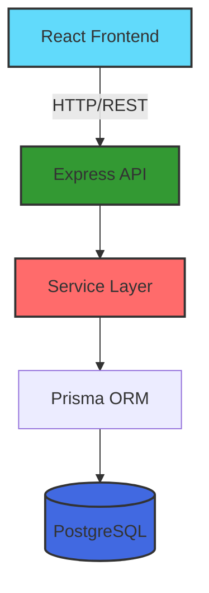
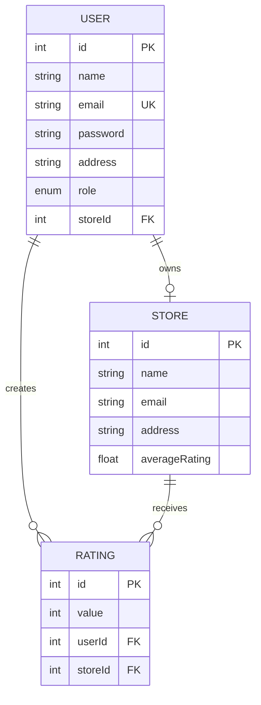

<div align="center">

# 🏪 Store Rating Platform

**Full-stack web application for store ratings with role-based access control**

[](https://reactjs.org/)
[](https://nodejs.org/)
[](https://www.postgresql.org/)
[](https://expressjs.com/)

[Demo](#-demo-credentials) • [Features](#-features) • [Tech Stack](#-tech-stack) • [Quick Start](#-quick-start) • [API](#-api-endpoints)

</div>

---

## 📋 Overview

A production-ready store rating platform enabling users to discover, rate, and manage stores. Features JWT authentication, role-based access control (Admin, Store Owner, Normal User), and comprehensive testing with 277 passing tests.

### 🎥 Demo Credentials

| Role | Email | Password |
|------|-------|----------|
| Admin | admin@test.com | Admin@123 |
| Store Owner | owner@test.com | Owner@123 |
| Normal User | alice@test.com | User@123 |

---

## ✨ Features

### 👥 Three User Roles

**System Administrator**
- Manage users and stores (create, view, filter, sort)
- View platform statistics (total users, stores, ratings)
- Full CRUD operations

**Store Owner**
- View ratings for owned store
- See average rating and customer feedback
- Access performance metrics

**Normal User**
- Register and browse stores
- Search stores by name/address
- Submit and modify ratings (1-5 stars)
- Update password

### 🔐 Security & Validation

- JWT authentication with httpOnly cookies
- Bcrypt password hashing (12 salt rounds)
- Role-based authorization middleware
- Input validation (frontend & backend)
- SQL injection prevention (Prisma ORM)
- Form validations:
  - Name: 20-60 characters
  - Email: Valid format
  - Password: 8-16 chars, 1 uppercase, 1 special char
  - Address: Max 400 characters
  - Rating: Integer 1-5

---

## 🏗️ System Architecture



### 💾 Database Schema



---

## 🛠️ Tech Stack

**Frontend:** React 18, React Router, Tailwind CSS, Axios  
**Backend:** Node.js, Express.js, Prisma ORM, PostgreSQL  
**Auth:** JWT, Bcrypt  
**Testing:** Jest, Fast-check (Property-Based Testing)

---

## 🚀 Quick Start

### Prerequisites
```bash
Node.js >= 14.x
PostgreSQL >= 12.x
```

### Installation

```bash
# Clone repository
git clone https://github.com/rushikeshxdev/store-rating-platform.git
cd store-rating-platform

# Install dependencies
cd server && npm install
cd ../client && npm install

# Setup environment variables
cp server/.env.example server/.env
cp client/.env.example client/.env
# Edit server/.env with your database credentials

# Setup database
cd server
npx prisma migrate dev
npx prisma generate
node seed-test-data.js  # Optional: Load test data
```

### Run Application

```bash
# Terminal 1: Backend (http://localhost:5000)
cd server && npm run dev

# Terminal 2: Frontend (http://localhost:3000)
cd client && npm start
```

---

## 📡 API Endpoints

### Authentication
- `POST /api/auth/register` - Register new user
- `POST /api/auth/login` - User login
- `POST /api/auth/logout` - User logout
- `GET /api/auth/me` - Get current user

### Users (Admin Only)
- `POST /api/users` - Create user
- `GET /api/users` - List users (with filters & sorting)
- `GET /api/users/:id` - Get user details
- `PUT /api/users/:id/password` - Update password

### Stores
- `POST /api/stores` - Create store (Admin)
- `GET /api/stores` - List stores (with search & filters)
- `GET /api/stores/:id` - Get store details

### Ratings
- `POST /api/ratings` - Submit rating (Normal User)
- `PUT /api/ratings/:id` - Update rating (Normal User)
- `GET /api/ratings/store/:storeId` - Get store ratings (Owner)

### Dashboard
- `GET /api/dashboard/admin` - Admin statistics
- `GET /api/dashboard/owner` - Owner statistics

---

## 🧪 Testing

```bash
cd server
npm test                    # Run all tests
npm test -- --coverage      # With coverage
```

**Test Coverage:**
- ✅ 277 tests passing
- Property-based testing with fast-check
- Unit tests for services, controllers, middleware
- Integration tests for API endpoints
- Security and validation tests

---

## 📁 Project Structure

```
store-rating-platform/
├── client/                 # React frontend
│   ├── src/
│   │   ├── components/    # UI components
│   │   ├── pages/         # Page components
│   │   ├── context/       # Auth context
│   │   ├── services/      # API services
│   │   └── App.js
│   └── package.json
│
├── server/                # Express backend
│   ├── prisma/
│   │   └── schema.prisma  # Database schema
│   ├── src/
│   │   ├── controllers/   # Request handlers
│   │   ├── middleware/    # Auth & validation
│   │   ├── routes/        # API routes
│   │   ├── services/      # Business logic
│   │   └── server.js
│   └── package.json
│
└── README.md
```

---

## 🔒 Security Features

| Feature | Implementation |
|---------|----------------|
| Authentication | JWT with httpOnly cookies |
| Password Hashing | Bcrypt (12 salt rounds) |
| Authorization | Role-based middleware |
| Input Validation | Frontend & Backend |
| SQL Injection | Prisma ORM (parameterized queries) |
| XSS Protection | Input sanitization |

---

## 👨‍💻 Author

**Rushikesh Bapu Randive**

[](https://github.com/rushikeshxdev)
[](https://linkedin.com/in/rushikeshnandre)
[](mailto:rushirandive09@gmail.com)

---

## 📄 License

MIT License - see [LICENSE](LICENSE) file for details

---

<div align="center">

**⭐ Star this repository if you find it helpful!**

</div>
